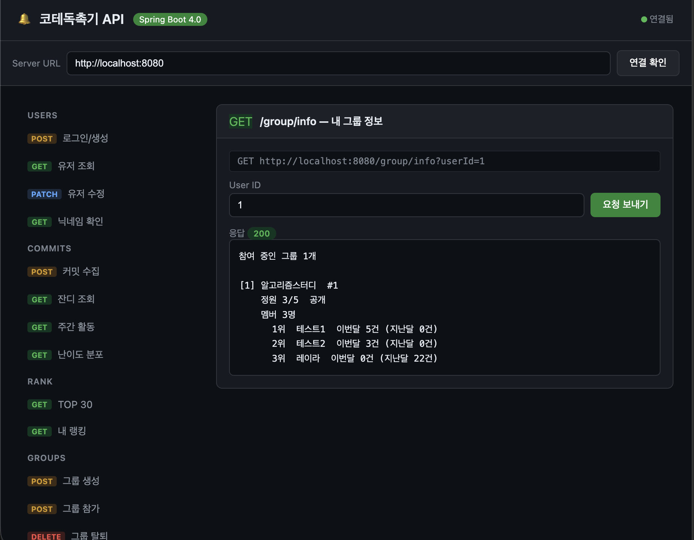
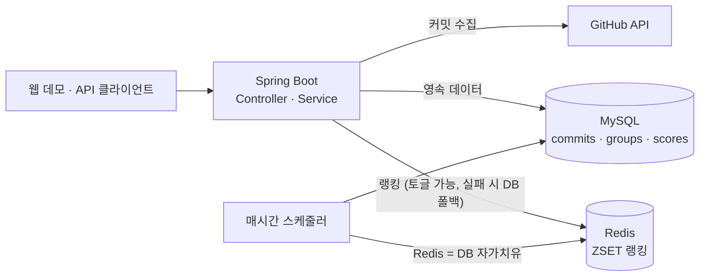

# 코테독촉기

[](https://github.com/Layla7120/code_test_reminder_server/actions/workflows/test.yml)

GitHub 저장소의 백준 풀이 커밋을 모아 **월별 랭킹**을 매기는 서비스. 그룹을 만들어 서로의 진척을 비교한다.
대학교 4학년 프로젝트로 **Flask**로 만들고 이후 **Kotlin + Spring Boot**로 옮겼다 — 두 구현이 한 저장소에 있다.

**기능은 조회·정렬·삽입·삭제가 전부다.**

<!-- 데모 스크린샷: 아래 "실행"으로 서버를 띄우고 http://localhost:8080 을 캡처해서
     docs/demo.png 로 저장한 뒤, 다음 줄의 주석을 풀면 됩니다.

-->

## 아키텍처



## 구조

```
server/       Kotlin + Spring Boot 구현 (현재)
app/          Flask 구현 (원본. 대조용, 유지보수 안 함)
migrations/   Flask 시절 Alembic 마이그레이션 (2개)
bench/        랭킹 성능 A/B 측정
infra/        init.sql — DB 스키마
docs/         기록
```

설계 판단과 트레이드오프 — 왜 Redis가 이 규모에 과했는지, `init.sql`이 마이그레이션 도구가 아닌 이유,
결함이 어디서 왔는지 — 는 **[docs/기록.md](docs/기록.md)** 에 있다. 잘한 것보다 틀린 것을 더 자세히 적었다.

> 필요 없는 복잡도를 넣었고, 거기서 버그가 나왔고, 측정해보니 그 복잡도가 애초에 필요 없었다.

## 실행

**테스트** (Docker만 있으면 됨):

```bash
export JAVA_HOME="$(/usr/libexec/java_home -v 21)"
cd server && ./gradlew test
```

Testcontainers가 실제 MySQL·Redis를 띄운다 (**74개 통과**). 이어서 `verifyEndpointCoverage`가
HTTP 테스트 없는 엔드포인트를 찾으면 빌드를 깬다. push·PR마다 GitHub Actions에서도 같은 명령이 돈다.

> `openjdk@21`이 PATH에 없으면(Homebrew keg-only) JAVA_HOME을 직접 지정:
> `/opt/homebrew/opt/openjdk@21/libexec/openjdk.jdk/Contents/Home`

**서버**:

```bash
docker compose up -d          # MySQL + Redis
export DB_USER=reminder DB_PASSWORD=reminder DB_NAME=reminder GITHUB_TOKEN=...
cd server && ./gradlew bootRun    # http://localhost:8080 (웹 데모 포함)
```

실행 상세·API 명세·트러블슈팅 → [server/README.md](server/README.md) · 성능 측정 → [bench/README.md](bench/README.md)

## 기술 스택

| | Flask (원본) | Kotlin/Spring Boot (현재) |
|---|---|---|
| 언어 | Python 3.11 | Kotlin (JDK 21) |
| 프레임워크 | Flask 3.1 + Smorest | Spring Boot 4.0 |
| ORM | SQLAlchemy 2.0 | Spring Data JPA |
| 캐싱 | Flask-Caching (프로세스 로컬) | Redis |
| 테스트 | 없음 | Testcontainers, 74개 |

## 주요 API

| 메서드 | 경로 | 설명 |
|---|---|---|
| `POST` | `/commits` | GitHub에서 커밋 수집 |
| `GET` | `/commits/grass` | 잔디(날짜별 커밋 수) |
| `GET` | `/rank` | 전체 상위 30명 |
| `GET` | `/rank/users?userId=` | 개인 순위 |
| `POST` | `/group`, `/group/member` | 그룹 생성 · 참여 |
| `GET` | `/group/info?userId=` | 내 그룹 + 멤버 현황 |

인증은 없다(`permitAll`). `userId`를 파라미터로 받는다 — 원본과 동일하며 범위에 넣지 않았다.
