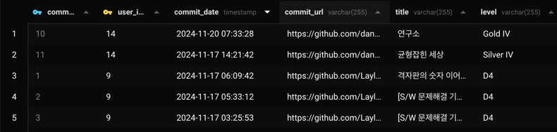

# 코테 독촉기 Server

## 기술 스택
- Flask: 웹 프레임워크 
- Flask-Smorest: OpenAPI 지원 및 유효성 검사 
- Flask-SQLAlchemy: 데이터베이스 ORM 
- Marshmallow: 스키마 유효성 검사 
- MariaDB: 기본 데이터베이스
---
## API 문서
API의 자세한 스펙은 Swagger UI를 통해 확인할 수 있습니다.

Swagger URL
- Swagger UI: http://127.0.0.1:5000/docs/swagger-ui

--- 
## 프로젝트 구조

```bash 
Code_Test_Reminder_Server/
├── app/
│   ├── __init__.py          # 앱 팩토리 및 확장 설정
│   ├── models.py            # SQLAlchemy 모델
│   ├── routes/
│   │   ├── commit_routes.py
│   │   ├── github_routes.py 
│   │   ├── group_routes.py  
│   │   ├── user_routes.py   
│   ├── services/            # 데이터베이스 로직들
│   │   ├── commit_service.py 
│   │   ├── github_service.py  
│   │   ├── group_service.py  
│   │   ├── participate_service.py  
│   │   ├── user_service.py  
├── tests/
│   ├── test_user.py         # API 단위 테스트
├── config.py                
├── run.py                   # 애플리케이션 실행 엔트리 포인트
├── requirements.txt         
├── README.md   
├── images                   # README용 images             
```

# 구현 내용
- [x] 사용자 GET `/users/?id=<user_id>`
  - 응답 예시 (성공):
    ```json
    {
      "user_id": 1,
      "github_id": "Layla7120",
      "repository_name": "Code_Tests"
    }
    ```
- [x] 사용자 POST `/users/`
  - 요청 JSON:
    ```json
    {
      "github_id": "Layla7120",
      "repository_name": "Code_Tests"
    }
    ```
  - 응답 예시 (성공):
    ```json
    {
      "user_id": 1,
      "github_id": "Layla7120",
      "repository_name": "Code_Tests"
    }
    ```
- [x] GitHub Repo Get
  - `/github/repos?github_id=<github_id>&repository_name=<repository_name>`
    - 응답 예시 (성공):
    ```json
        [
          {
            "description": "This is an auto push repository for Baekjoon Online Judge created with [BaekjoonHub](https://github.com/BaekjoonHub/BaekjoonHub).",
            "html_url": "https://github.com/Layla7120/Code_Tests",
            "name": "Code_Tests"
          }
        ]
    ```
- [x] Github 에서 Commit 내역을 받아와, 중복이 아닐 경우 Commit DB 에 insert
  - `/commits/?user_id=<user_id>&github_id=<github_id>&repository_name=<repository_name>`
    ```json
    {
      "inserted_commits": 28,
      "message": "Successfully inserted 28 new commits."
    }
    ```
    

- [x] 데이터베이스에서 최근 7일간 커밋 내역 조회
  - `/commits/activity?user_id=<user_id>`
  ```json
  {
    "2024-11-17": {
      "committed": true,
      "weekday": "Sunday"
    },
    "2024-11-18": {
      "committed": false,
      "weekday": "Monday"
    },
    "2024-11-19": {
      "committed": false,
      "weekday": "Tuesday"
    },
    "2024-11-20": {
      "committed": true,
      "weekday": "Wednesday"
    },
    "2024-11-21": {
      "committed": false,
      "weekday": "Thursday"
    },
    "2024-11-22": {
      "committed": false,
      "weekday": "Friday"
    },
    "2024-11-23": {
      "committed": false,
      "weekday": "Saturday"
    }
  }
  ```

- [x] Create Group POST `/group/`
  - 요청 JSON
  ```json
  {
    "group_name": "코테2",
    "group_pw": "1234",
    "member_maxCnt": 5,
    "owner_user_id": 9
  }
  ```
  - 응답 예시 (성공):
  ```json
  {
    "group_name": "코테2",
    "member_maxCnt": 5
  }
  ```
  
- [x] user_id 를 이용해 소속된 group member 데이터 가져오기
  - `/group/info?user_id=<user_id>`
  ```json
  [
    {
      "group_commits": [
        {
          "commit_count": 9,
          "github_id": "Layla7120",
          "user_id": 9
        },
        {
          "commit_count": 5,
          "github_id": "dangeunii",
          "user_id": 14
        }
      ],
      "group_id": 4,
      "group_name": "코테"
    }
  ]
  ```
- [x] user_id, group_name 으로 group 에 추가 POST
  - `/group/member`
  ```json
     [
    {
      "group_commits": [
        {
          "commit_count": 9,
          "github_id": "Layla7120",
          "user_id": 9
        },
        {
          "commit_count": 5,
          "github_id": "dangeunii",
          "user_id": 14
        }
      ],
      "group_id": 4,
      "group_name": "코테"
    }
  ]
  ```