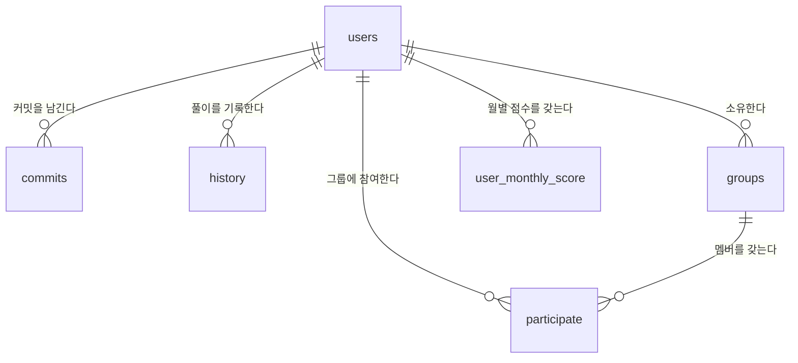

# 코테독촉기

[](https://github.com/Layla7120/code_test_reminder_server/actions/workflows/test.yml)

GitHub 저장소의 백준 풀이 커밋을 모아 **월별 랭킹**을 매긴다. 그룹을 만들어 서로의 진척을 비교한다.
대학교 4학년 프로젝트로 **Flask** 로 만들고 **Kotlin + Spring Boot** 로 옮겼다 — 두 구현이 한 저장소에 있다.
기능은 조회·정렬·삽입·삭제가 있다.


## 구조

```
server/       Kotlin + Spring Boot (현재)
app/          Flask (원본. 대조용, 유지보수 안 함)
migrations/   Flask 시절 Alembic 마이그레이션
bench/        랭킹 A/B 측정 기록 (Redis 시절. 지금은 재현 안 됨)
docs/         ADR · 용어집 · 기록
```

스키마의 진실 원천은 `server/src/main/resources/db/migration/` 의 Flyway 마이그레이션이다.

## 데이터


```mermaid
erDiagram
    users ||--o{ commits : "커밋을 남긴다"
    users ||--o{ history : "풀이를 기록한다"
    users ||--o{ participate : "그룹에 참여한다"
    users ||--o{ groups : "소유한다"
    users ||--o{ user_monthly_score : "월별 점수를 갖는다"
    groups ||--o{ participate : "멤버를 갖는다"
```

컬럼은 적지 않는다 — 마이그레이션이 원천이고, 여기 옮겨 적으면 낡는다.
**이 스키마를 읽는 핵심은 무엇이 원천이고 무엇이 파생인가다.**

| 파생                       | 원천          | 갱신                                                             |
| -------------------------- | ------------- | ---------------------------------------------------------------- |
| `user_monthly_score.score` | `commits`     | 커밋 저장과 **같은 트랜잭션**에서 `COUNT(*)` 절대값으로 덮어쓴다 |
| `groups.member_counter`    | `participate` | 조건부 원자적 `UPDATE` (`WHERE counter < max`)                   |

절대값이라 몇 번을 다시 계산해도 같은 값이 나온다 — 증분(`+= n`)이 한 번 틀리면 복구가 안 됐던
문제를 구조로 없앤 것이다. 랭킹은 `user_monthly_score` **하나만** 읽는다. 예전에는 Redis ZSET 이
세 번째 사본이었고, 사본들이 어긋나는 게 결함의 출처였다.

`user_monthly_score` 에 **행이 있다 = 랭킹에 포함된다.** 그래서 랭킹 쿼리는 `users` 를 조인하지
않고, 탈퇴자는 FK 의 `ON DELETE CASCADE` 가 행을 지워서 빠진다
(조인을 없앤 효과는 5만 행 기준 87ms → 0.5ms. 2026-08-17 측정).

## 실행

**테스트** — Docker 만 있으면 된다. Testcontainers 가 실제 MySQL 을 띄운다.

```bash
export JAVA_HOME=/opt/homebrew/opt/openjdk@21/libexec/openjdk.jdk/Contents/Home
./server/gradlew -p server test
```

**서버**

```bash
docker compose up -d          # MySQL (스키마는 기동 시 Flyway 가 만든다)
export DB_USER=reminder DB_PASSWORD=reminder DB_NAME=reminder GITHUB_TOKEN=...
./server/gradlew -p server bootRun    # http://localhost:8080 (웹 데모 포함)
```

인증은 없다(`permitAll`). `userId` 를 파라미터로 받는다 — 원본과 동일하며 범위에 넣지 않았다.

## 더 읽을 것

|                       |                                                                    |
| --------------------- | ------------------------------------------------------------------ |
| 왜 그렇게 정했나      | [docs/adr/](docs/adr/) — 결정 하나당 한 파일                       |
| 용어                  | [docs/용어집.md](docs/용어집.md)                                   |
| 틀린 것과 그 경위     | [docs/기록.md](docs/기록.md) — 잘한 것보다 틀린 것을 자세히 적었다 |
| 고칠 때 지킬 것       | [AGENTS.md](AGENTS.md)                                             |
| API 명세 · 트러블슈팅 | [server/README.md](server/README.md)                               |
| 성능 측정 **기록** | [bench/README.md](bench/README.md) — Redis 를 걷어낸 근거. 지금은 재현되지 않는다 |

> 필요 없는 복잡도를 넣었고, 거기서 버그가 나왔고, 측정해보니 그 복잡도가 애초에 필요 없었다.
